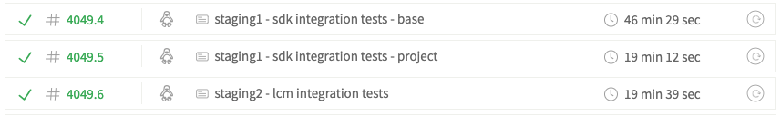
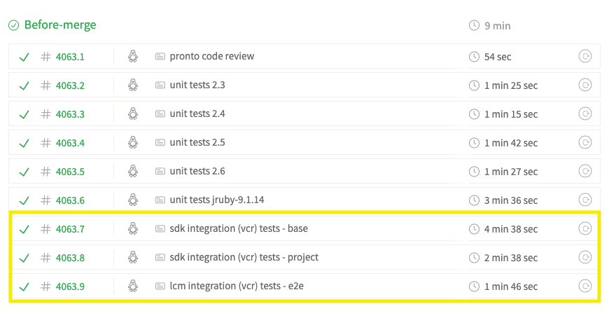

title: VCR
subtitle: War Stories
description: VCR War Stories
author: Jan Zdráhal
theme: black

# What's VCR?

- stands for Video Cassette Recorder
- records your test suite's HTTP interactions and replays them during future test runs for fast, deterministic, accurate tests
- [https://github.com/vcr/vcr](https://github.com/vcr/vcr)

<aside class="notes">
    Before presentation rm -rf cassettes/

    Was using VCR in my previous job. I'd like to talk about how it helped us to a fast and stable continuous integration. But also about problems we had with it.
</aside>

# Example

``` ruby
require 'vcr'

VCR.configure do |c|
  c.cassette_library_dir = 'cassettes'
  c.hook_into :webmock
  c.configure_rspec_metadata!
  c.default_cassette_options = { :record => :new_episodes }
end

describe "VCR", :vcr do
  it 'records an http request' do
    5.times do
      puts Net::HTTP.get_response('localhost', '/', 4567).body
    end
  end
end
```

# Example Server

``` ruby
require 'sinatra'

get '/' do
  sleep 1
  'Hello Ruby Stories!'
end
```

# Demo

<video src="vcr_demo.mov"></video>

<aside class="notes">
    1) bundle exec rspec test.rb
    2) run test again - fast and deterministic this time
    3) git status & explain ./cassettes
    4) test.rb: 5.times -> 6.times and run test again
</aside>

# How it works?

- checks HTTP method, URI, host, path, body and headers
- matchers for nondeterministic URIs

``` ruby
random_id_matcher = lambda do |actual, recorded|
  random_id_regex = %r{/uploads/.+}
  actual.parsed_uri.path.match random_id_regex
end
```

# Why we used it?

<aside class="notes">
    I came to the company to work on a project which had a...
</aside>

## 45 Minute CI Build

- caused by a lot of integration tests
- ran on every PR
- 45 minutes to find out your code is broken
- every glitch of the staging server fails the build
- high load on the staging server
- hitting request limits

<aside class="notes">
    ...45 minute CI build which ran on every PR. This wasn't your ordinary Rails app, but an SDK which makes a lot of HTTP requests. With almost no mocked unit tests, development was sluggish and frustrating. Imagine you make a PR and after 45 minutes you learn the testing server was down and have to rerun the build. After another 45 minutes you find a small bug, fix it, rerun and so on.
</aside>

## Solution Attempt #1

- running unit tests with every PR and integration tests only once a day
- too many bugs getting to the develop branch
- we would learn about our bugs the next day (after switching context)

## The Solution

> With VCR, the same test suite finishes in under 5 minutes. That's 88% faster!


## VCR Setup

- live tests [running every day](https://travis-ci.org/gooddata/gooddata-ruby/builds/520872126)

# Problems

> Making your tests run under VCR is not a walk in the park.

## Initial Investment

- VCRizing the tests took weeks (the dev was new to the project and language though)
- all blocks (not recorded by default)(https://github.com/gooddata/gooddata-ruby/blob/master/spec/spec_helper.rb#L70)
- [parallelism](https://github.com/gooddata/gooddata-ruby/blob/master/spec/spec_helper.rb#L60)

<aside class="notes">
    well isolated tests needed
</aside>

## Development Overhead
- re-recording cassettes with almost every change
- recording cassettes could be automated
- writing matchers cannot be automated
- problems with recording from the middle of the test suite (e.g. [project cache](https://github.com/gooddata/gooddata-ruby/blob/master/spec/vcr_configurer.rb#L65-L71))
- where to store 390M of cassettes?

## Unit Tests?
- it's tempting not to write unit tests
- unit tests are needed for covering edge cases
- if it's hard to write tests, the code is probably too complex
- fortunately test coverage can be checked automatically (e.g. Coveralls)

# Summary
> VCR helped us make our 45 minute CI build run in under 5 minutes. The build is reliable and doesn't produce load on the staging server. Developers are happier and more productive because of the fast turn-around. There was a substantial initial investment and there is some development overhead (recording, writing matchers, troubleshooting). In our case, the benefits significantly outweigh the costs.
